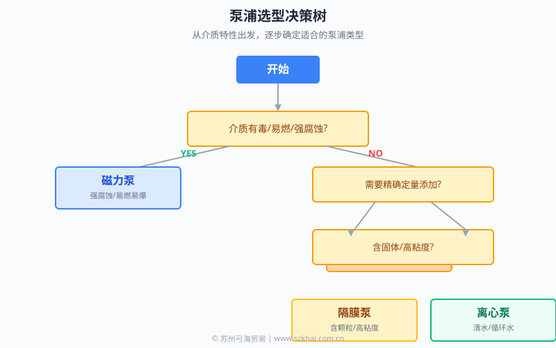

# 工业泵浦选型指南

> **如何为你的工况选择正确的泵浦**  
> 基于 40 年行业经验，覆盖磁力泵、离心泵、隔膜泵、计量泵的选型决策树

## 选型决策流程图




```
开始
  ↓
[问题 1] 介质是否有毒/易燃/强腐蚀？
  ↓ YES                ↓ NO
磁力泵类          [问题 2] 需要精确定量添加吗？
                    ↓ YES              ↓ NO
                计量泵            [问题 4] 是否含颗粒？
                                    ↓ YES              ↓ NO
                                隔膜泵            离心泵
```

## 4 大维度选型

### 1. 按介质选型

| 介质类型 | 推荐泵浦 | 备选 |
|---------|---------|------|
| 强酸强碱 | 磁力泵（PTCXPUMP/INNOMAG）| 衬氟离心泵 |
| 易燃易爆 | 磁力泵 | 气动隔膜泵 |
| 高纯试剂 | 磁力泵（内衬系列）| - |
| 清水/循环水 | 离心泵 | - |
| 含颗粒浆料 | 离心泵（开式叶轮）| 隔膜泵 |
| 黏度高 | 螺杆泵 | 齿轮泵 |

### 2. 按温度选型

| 温度范围 | 推荐泵浦 |
|---------|---------|
| -80°C ~ +280°C | PTCXPUMP PS（金属不锈钢）|
| -40°C ~ +180°C | INNOMAG 内衬系列 |
| 常温 ~ 100°C | 离心泵 |
| 高温 200°C+ | 高温磁力泵（金属外壳）|

### 3. 按压力选型

| 压力等级 | 推荐泵浦 |
|---------|---------|
| 低压（<10 bar）| 离心泵、磁力泵 PL 系列 |
| 中压（10-25 bar）| 磁力泵 PS 系列 |
| 高压（>25 bar）| 多级离心泵、磁力泵高压款 |

### 4. 按行业选型

| 行业 | 主流方案 |
|------|---------|
| **化工** | 磁力泵（不锈钢/工程塑料）|
| **半导体** | 磁力泵（内衬/高纯度系列）|
| **PCB** | 磁力泵（耐强酸强碱）|
| **制药** | 磁力泵（卫生级）|
| **食品** | 卫生级离心泵、磁力泵 |
| **环保/废水** | 离心泵、隔膜泵 |
| **石油石化** | 离心泵、磁力泵（高温高压）|

## 选型决策矩阵

| 关键指标 | 离心泵 | 磁力泵 | 隔膜泵 | 计量泵 |
|---------|-------|-------|-------|-------|
| 强腐蚀介质 | ⚠️ | ✅ | ✅ | ⚠️ |
| 高纯度介质 | ⚠️ | ✅ | ✅ | ⚠️ |
| 含颗粒 | ✅ | ❌ | ✅ | ⚠️ |
| 定量添加 | ❌ | ❌ | ⚠️ | ✅ |
| 高温 | ✅ | ✅ | ⚠️ | ⚠️ |
| 高压 | ✅ | ✅ | ⚠️ | ⚠️ |
| 大流量 | ✅ | ⚠️ | ⚠️ | ❌ |
| 维护成本 | 中 | 低 | 中 | 低 |
| 初期成本 | 低 | 中 | 中 | 中 |

## 4 步选型法

### 步骤 1：明确介质特性
- 腐蚀性、温度、粘度、是否有毒
- 是否含颗粒

### 步骤 2：确定流量扬程
- 实际流量 = 峰值流量 × 1.1~1.2
- 扬程 = 实际管路阻力 + 几何高差 + 一定余量

### 步骤 3：校验 NPSH
- 计算 NPSHa（实际有效净正吸入压头）
- 选型时 NPSHa > NPSHr + 0.5m

### 步骤 4：选定系列 + 材质
- 根据介质和工况选系列
- 根据温度和耐腐蚀要求选材质

## 常见选型误区

1. **过度设计**：仅需清水循环选了选型高温高压泵
2. **低估腐蚀**：选了普通材质导致半年腐蚀穿孔
3. **忽略汽蚀**：未校 NPSH 导致叶轮早期损坏
4. **只看价格**：忽视维护成本和安全风险

## 联系弓海

具体选型建议请联系弓海技术人员：
- 🌐 官网：https://www.szkhai.com.cn
- 📞 电话：0512-62570717

## 资料结构

- 📄 `data/selection-criteria.json` — 选型数据结构化
- 📚 `docs/by-medium.md` — 按介质选型详细
- 📚 `docs/by-temperature.md` — 按温度选型详细
- 📚 `docs/by-industry.md` — 按行业选型详细

---

> 🔗 更多信息请访问弓海官网：**https://www.szkhai.com.cn**